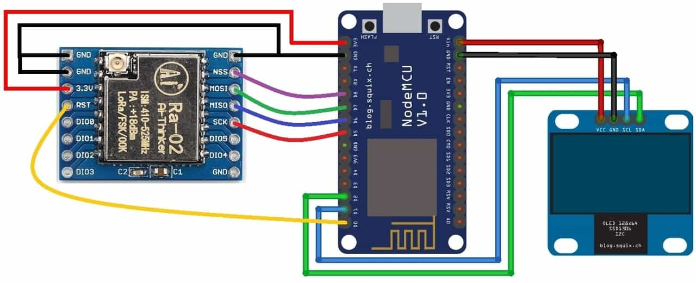

LoRa Transmitter

Hardware:

1. ESP8266, preferably Node MCU v1
2. SX1278 LoRa module with antenna

PinOut:

| NodeMCU Pins | SX1278 Pins |
| -------------- | ------------- |
| GND          | GND         |
| 3.3V         | VCC         |
| D8           | NSS         |
| D7           | MOSI        |
| D6           | MISO        |
| D5           | SCK         |
| D0           | RST         |

[Refer Tutorial](https://how2electronics.com/lora-sx1278-esp8266-transmitter-receiver/https:/)

